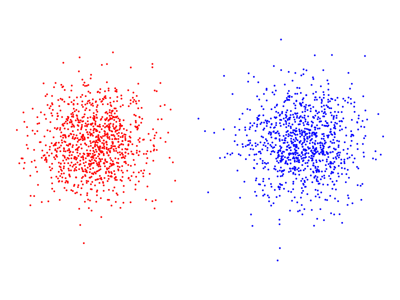
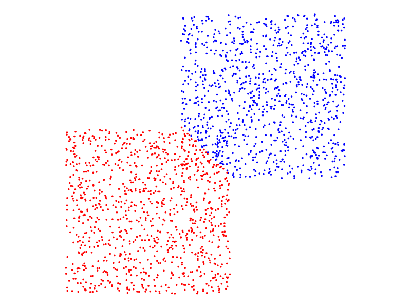
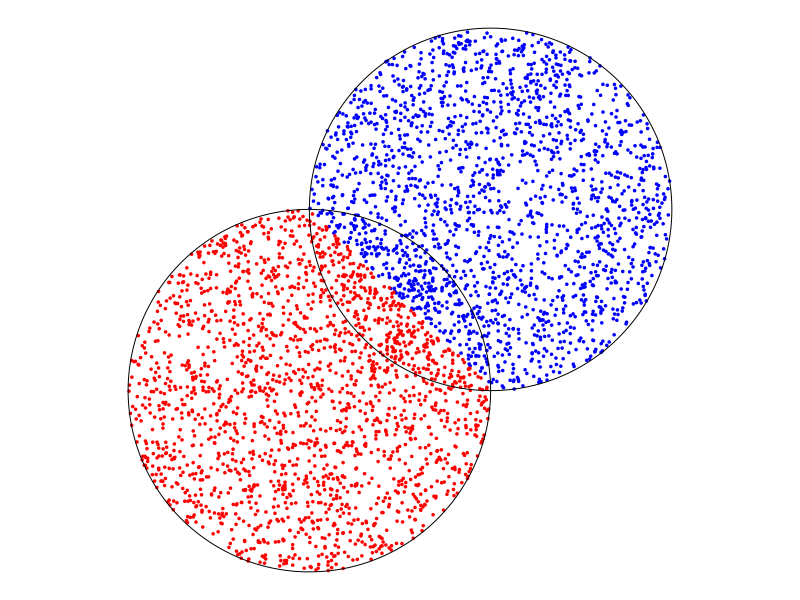

# `kMeansDemo`

This is a small demonstration project of k-means clustering with k=2 and in two dimensions.

See `kMeans` for a better implementation. This was just a first attempt.

## Point Sets

Points are represented as complex numbers. Input to the method is a list (`Vector`) of points. 

For demonstration purposes, we provide the function `double_cluster` to generate a set of points. 

Usage: `double_cluster(n, offset)` generates a list of `2n` points. The first `n` points are
Gaussian normal centered around the origin and the second `n` points are Gaussian normal 
centered around `offset`. 

For example, `double_cluster(1000, 3+3im)`. 

## Single stepping through the k-means algorithm

The function `one_step` is used to perform one step of the `k`-means algorithm. 

If `pts` is the list of points, then `a,b = rand_split(pts)` partitions `pts` into two lists 
`a` and `b` by randomly assigning points to `a` or `b`.

Invocations of `one_step` looks like this `a,b = one_step(a,b)`. If the new partition 
is the same as the given partition, the message `No change` is displayed.

## All-in-one operation

Use `a,b = kmeans(pts, max_steps)` to randomly partition the data and then take
single steps until convergence or `max_steps`, whichever occurs first. 

## Visualization

`draw_data(pts)` plots all points in `list` as blue dots.

`draw_data(a,b)` plots the points in `a` in blue and the points in `b` in red. 

## Example

### Two Gaussian clusters

```
julia> using kMeansDemo

julia> pts = double_cluster(1000,5);

julia> a,b = kmeans(pts);
1 [ Info: No change
2 
julia> draw_data(a,b)
```
The result looks like this: 



### Two uniform square clusters

```
julia> pts = double_square(1000, 0.7+0.7im);

julia> a,b = kmeans(pts);
1 2 3 4 [ Info: No change
5 
julia> draw_data(a,b)
```
The result looks like this:




### Two uniform circular clusters

```
julia> using SimpleDrawing

julia> pts = double_circle(2000, 1+im);

julia> a,b = kmeans(pts);
1 2 3 4 5 6 7 [ Info: No change
8 
julia> draw_data(a,b)

julia> draw_circle(0,0,1,color=:black)

julia> draw_circle(1+im,1,color=:black)
```
The result looks like this:


